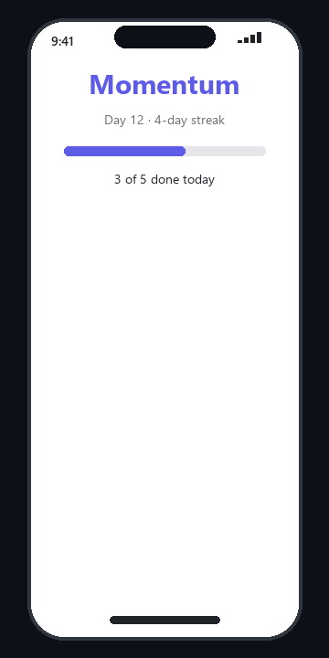

# Momentum - A Habit Tracker in Kite

Momentum is a polished, multi-screen habit tracker built entirely with [Kite](https://github.com/TanimowoObaloluwaDavid/kite) — Kite's own programming language that compiles to real Flutter apps.

## Features

- **Multi-screen**: Home · Stats · Streak with smooth goto navigation
- **Custom components**: make habitToggle(...) { ret btn(...) } keeps UI composable
- **Reactive**: Tapping toggles habits, progress bars recalculate instantly
- **Polished UI**: Styled text, colored buttons, ar progress, 
ow layouts

## Run it

`ash
# From the kite repo or with kite installed
python -m kite run momentum.kite
`

## Build to Flutter

`ash
python -m kite build momentum.kite -o momentum.dart
# Copy momentum.dart into lib/main.dart of a Flutter project, then flutter run
`

## Built with

Kite v0.2 — lexer · parser · interpreter · Dart transpiler. Uses screen, goto, make, 
et, each, when, ar, spacer.

